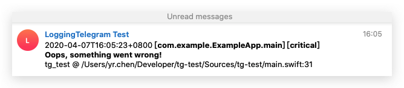

# LoggingTelegram ✈️


Welcome to **LoggingTelegram** – a logging backend for [SwiftLog](https://github.com/apple/swift-log) that sends log messages by a [Telegram Bot](https://core.telegram.org/bots). Inspired by and forked from [LoggingSlack](https://github.com/wlisac/swift-log-slack). 

## Usage 📝

### Setup Telegram Bot

LoggingTelegram uses [Telegram Bot API](https://core.telegram.org/bots/api) to send log messages to any Telegram chat.

You can chat with [BotFather](https://t.me/BotFather) to create a new bot and get its API token. The config methods are described [here](https://core.telegram.org/bots#6-botfather). 

You need to pass the token to `TelegramLogHandler` to set it up. 

### Get a Target Chat ID

You can access a chat by its ID. There are various ways to get the ID of a chat, some are discussed in [this thread](https://stackoverflow.com/questions/31078710/how-to-obtain-telegram-chat-id-for-a-specific-user). 

You can create a group chat with `TelegramGroup.id(_:Int)`, a channel with `TelegramChannel.id(_:Int)` and a user chat with `TelegramUser.id(_:Int)`.

Alternatively, you can create a channel by its name:  `TelegramChannel.name(_:String)`, remember to drop '@' prefix.

### @someone in a Group Chat or a channel

You can mention someone in a group chat or a channel, simply by the various `.mentioning()` APIs, listed below:

```swift
var chat = TelegramChannel.name("test")

// By TelegramUser
let users = [1,2].map { TelegramUser.id($0) }
chat = chat.mentioning(users) // Returns a new TelegramChannel instance
// You can use his username to mention a user
let user = TelegramUser.name("testme")
chat = chat.mentioning(user)

// By TelegramRawId (A more flexible alias of the "TelegramUser" version)
chat = chat.mentioning(.id(3))
chat = chat.mentioning([.name("newtest"), .id(4)])

// By User ID
chat = chat.mentioning(5)
chat = chat.mentioning([6,7,8])

// By Username
chat = chat.mentioning("test 1")
chat = chat.mentioning(["test 2", "test 3"])
```

In brief, the chaining style is recommended to create a chat:

```swift
TelegramChannel.name("test").mentioning([.id(1), .name("2"), .id(3)])
// or
TelegramChannel.name("test").mentioning([1, 3]).mentioning("2")
```

### Bootstrap SwiftLog

LoggingTelegram is intended to be used as a secondary logging backend to send urgent log messages directly to Telegram.

You can use SwiftLog's `MultiplexLogHandler` to setup LoggingTelegram with another logging backend.

```swift
import Logging
import LoggingTelegram

let channel = TelegramChannel.name("test").mentioning([1, 3]).mentioning("2")

LoggingSystem.bootstrap { label in
    MultiplexLogHandler([
        // Setup TelegramLogHandler with your API Token and Chat instance
        TelegramLogHandler(label: label, token: "Your Bot Token Here", chat: channel),
        
        // Setup the standard logging backend to enable console logging
        StreamLogHandler.standardOutput(label: label),
        
        // Setup multiple TelegramLogHandlers
        // TelegramLogHandler(label: label, token: "Your (Another) Bot Token Here", chat: TelegramGroup.id(123))
    ])
}
```

### Using a Logger

You can now use SwiftLog as usual and critical log messages are sent directly to Telegram. Test code as below. 

```swift
import Logging

let logger = Logger(label: "com.example.ExampleApp.main")

logger.critical("Oops, something went wrong!")
```

### Logger Output

The logger will send a Telegram message as a bot (if the level matches) and a console message since both logging backends were setup. The example above gives the following outputs: 



```plain
2020-04-07T16:05:25+0800 critical: Oops, something went wrong!
```

### Log Level

Only messages of [log level](https://github.com/apple/swift-log#log-levels)  `critical` are sent to Telegram by default.

You can adjust the log level minimal for a specific `TelegramLogHandler` by setting its `logLevel` property, or initializing with a `level` property. 

```swift
var handler = TelegramLogHandler(label: "test", token: "Your Bot Token Here", chat: TelegramGroup.id(123), level: .error)
handler.logLevel = .info // Unrecommended! Low log levels may burden the server and abuse the Telegram function.
```

You can change the default for all `TelegramLogHandler`s by changing the value of `telegramLogDefaultLevel`. 

```swift
telegramLogDefaultLevel = .error
```

Remember, the `TelegramLogHandler.logLevel` property has a priority to `telegramLogDefaultLevel`. 

### Mute Setting

To not disturb subscribers, you may need to mute the message. You can pass a `mute: Bool` to the initializer to make it silent:

```swift
TelegramLogHandler(label: label, token: "Your Bot Token Here", chat: channel, mute: true)
```

## Installation 📦

LoggingTelegram requires Xcode 11 or a Swift 5.2 toolchain with the Swift Package Manager. 

Add the LoggingTelegram package as a dependency to your `Package.swift` file.

```swift
.package(url: "https://github.com/stevapple/swift-log-telegram.git", from: "0.0.1")
```

Add LoggingTelegram to your target's dependencies.

```swift
.target(name: "Example", dependencies: ["LoggingTelegram"])
```

## Attention ⚠️

You should know what you're doing though this package. Do not use it at client-side to protect the subscribers' info and your Bot Token. 
